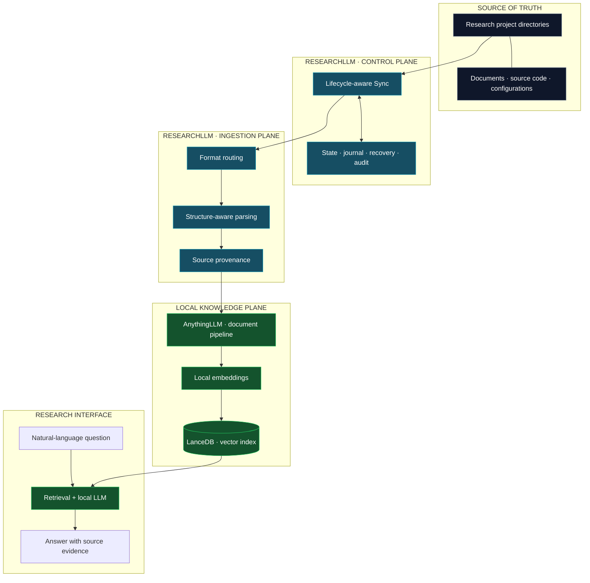
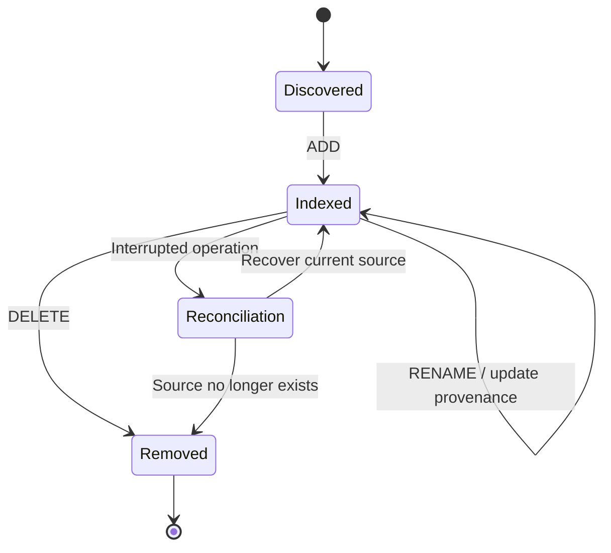
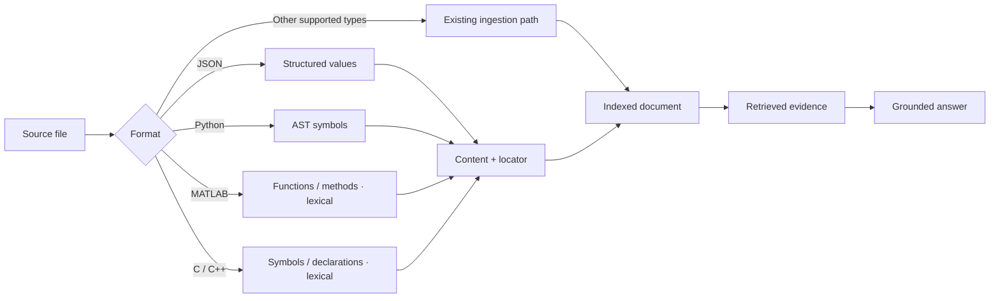
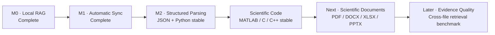

<div align="center">

# ResearchLLM

### Research knowledge, beyond document chat.

**A local-first research knowledge infrastructure for continuously evolving scientific projects.**

*Automatic synchronization · Structure-aware parsing · Verifiable provenance · Reliable indexing*

[](#project-status)
[](#engineering-status)
[](#engineering-status)
[](#validation)
[](#architecture)

**[Architecture](#architecture)** · **[Capabilities](#capabilities)** · **[Validation](#validation)** · **[Roadmap](#roadmap)** · **[Project status](#project-status)**

</div>

---

## The idea

Research doesn't live in a chat window. It lives in changing project directories: source code, experiment configurations, datasets, papers, reports, notebooks, and results.

Traditional document-centric RAG starts with **upload → embed → ask**. ResearchLLM explores a different abstraction:

> **Treat the research directory as the source of truth. Treat everything derived from it as replaceable infrastructure.**

That means making changes discoverable, references traceable, and the knowledge index recoverable as projects evolve.

```text
                  RESEARCH FILES ARE THE SOURCE OF TRUTH
                                     │
                   Continuous synchronization + provenance
                                     │
                    Structure-aware research knowledge
                                     │
                       Grounded, traceable answers
```

## Architecture

### 01 / System overview

The current prototype combines a custom research synchronization layer with an [AnythingLLM](https://github.com/Mintplex-Labs/anything-llm)-based retrieval environment and local model inference.



**Architectural boundary:** source files are durable research assets; indexes and embeddings are derived representations. The prototype is intentionally designed around that separation.

### 02 / Document lifecycle

A research file is not static. The indexing system needs to respond to its lifecycle rather than only its first upload.



The tested sync baseline includes modification and rename handling, an operation journal, recovery from a **simulated** interrupted transaction, consistency audits, and explicit cleanup of stale managed documents.

### 03 / From bytes to evidence

The structure-aware pipeline has been validated for JSON key paths, Python AST symbols, and conservative MATLAB/C/C++ lexical structures. The parser attaches available source locations to extracted content; it does not execute source code.



For example, on **synthetic test data**:

```text
Question  What is the configured maximum motor speed?
Answer    20,480 RPM
Source    Projects/Example/settings.json
Locator   $.motor.max_rpm
```

```text
Question  Where is the conversion method defined?
Symbol    ParserMotorController.pwm_to_rpm
Source    Projects/Example/controller.py
Lines     4–6
```

The v0.4.0 synthetic scientific-code tests additionally verified three source-located symbols:

```text
MATLAB    compute_heat                         thermal.m:2–5
C         motor_pwm_to_rpm                    motor.c:3–5
C++       research::MotorController::set_pwm  controller.cpp:4–6
```

These are **controlled-fixture results**, not a guarantee of compiler-grade symbol analysis or universal source-citation accuracy.

---

## Capabilities

| Layer | Implemented and tested | Scope |
|:--|:--|:--|
| **Local knowledge pipeline** | Local embedding, vector search, model-grounded Q&A | Research documents |
| **Folder synchronization** | ADD · MODIFY · DELETE · RENAME | Watched research files |
| **Integrity** | Content fingerprints, tracked state, consistency audit | Managed documents |
| **Reliability** | Operation journal, single-worker protection, simulated crash recovery | Sync baseline |
| **Lifecycle hygiene** | Orphan detection and explicit cleanup | Managed remote records |
| **Structured parsing** | JSONPath, Python AST, MATLAB/C/C++ lexical symbols | JSON, Python, MATLAB, C, C++ |
| **Provenance** | Source paths and format-specific locators | Validated synthetic cases |
| **Daily workflow** | Automatic parser activation through the standard launcher | Local prototype |

### Format coverage is not the same as structural understanding

The ingestion pipeline accepts multiple text-like and common document formats. **Structure-aware source provenance has been validated for JSON, Python, MATLAB, C and C++ on controlled fixtures.** Python uses AST extraction; MATLAB/C/C++ use conservative lexical analysis, not compiler-grade semantic resolution.

PDF, DOCX, XLSX and PPTX remain ingestible through the existing document pipeline, but precise page, paragraph, slide, sheet and cell provenance has **not** yet been validated at the same level. An indexable file is not necessarily a structurally understood file.

---

## Validation

The project is developed through incremental testing rather than feature claims alone. Component releases are marked stable only within their stated, tested scope.

**Parser v0.4.0 — Scientific Code Intelligence / stable tested baseline**

```text
Offline regression tests                         57 / 57  PASS
JSON / Python v0.3.0 compatibility                       PASS
MATLAB / C / C++ structured ingestion                    PASS
Source symbol + line-range retrieval on fixtures         PASS
Scientific-code MODIFY (3 files)                         PASS
Scientific-code RENAME (3 files)                         PASS
Scientific-code DELETE (3 files)                         PASS
Unattended ingestion through the everyday launcher       PASS
Background deletion + final consistency audit            PASS
Frozen source, tests, SQLite state and SHA256 manifest    PASS
```

The final managed-source audit reported `source=0`, `state=0`, `missing_remote=0`, `orphans=0` after synthetic test cleanup. Two existing remote documents were outside the managed source set; the audit did not classify them as orphans.

The independent **Sync v0.2.1** baseline also covers lifecycle operations, explicit orphan cleanup and recovery from a **simulated** interrupted transaction. The v0.3.0 JSON/Python parser had previously passed 32/32 offline tests and controlled E2E validation.

**Known limitation:** an early combined multi-file question incorrectly rejected an existing MATLAB function while a targeted question found its correct symbol and line range. A later combined query succeeded, but cross-file recall and evidence synthesis remain insufficiently benchmarked. Lexical extraction is not full MATLAB/C/C++ semantic analysis, and these results are not production reliability claims.

---

## Engineering status

| Component | Baseline | State |
|:--|:--|:--|
| ResearchLLM Sync | **v0.2.1** | Stable *tested baseline* |
| JSON / Python Structured Parser | **v0.3.0** | Stable *tested baseline* |
| MATLAB / C / C++ Scientific Code Parser | **v0.4.0** | Stable *tested baseline* |
| Scientific document provenance (PDF / DOCX / XLSX / PPTX) | **v0.5.0** | Next |
| Cross-format and multi-file retrieval benchmarking | — | Planned / known quality gap |

> **Versioning note:** `Sync v0.2.1` and `Parser v0.4.0` are separate component versions. The entire ResearchLLM platform is not being presented as a production-ready v0.4.0 release.

---

## Design principles

**01 · Source-of-truth architecture**  
Keep primary research assets independent of models and indexes.

**02 · Provenance over plausible answers**  
A useful scientific answer identifies supporting evidence, not only a conclusion.

**03 · Lifecycle awareness**  
Updated and removed source files must not silently coexist with obsolete knowledge.

**04 · Failure-aware engineering**  
Auditability and recovery are part of the design, not afterthoughts.

**05 · Composable components**  
Ingestion, indexing, and generation should have clean boundaries.

---

## Roadmap



The next technical priority is **scientific document intelligence**: auditable page/section, paragraph/table, slide, sheet and cell locators. A separate retrieval-quality track will measure evidence recall and attribution across files, rather than treating isolated successful answers as a comprehensive benchmark.

---

## Technology

| Area | Foundation |
|:--|:--|
| Knowledge workspace and document pipeline | [AnythingLLM](https://github.com/Mintplex-Labs/anything-llm) |
| Local model runtime | [Ollama](https://ollama.com/) |
| Local language and embedding models | Qwen family |
| Vector index | LanceDB |
| Sync state and operation tracking | SQLite |
| Structural extraction | JSON paths / Python AST / MATLAB-C-C++ lexical parsers |

ResearchLLM builds on existing open-source foundations. Their respective trademarks and licenses remain with their owners.

---

## Project status

**Research prototype · Updated 2026-10-10**

This repository is a **public technical showcase** for the ResearchLLM project. It documents high-level architecture, engineering decisions, validated functionality, and development progress. It is **not currently an installable public source release**; internal source, research materials, test datasets, and deployment-specific configuration are not distributed here.

The published tests establish a controlled development baseline, not a claim of commercial readiness, comprehensive format support, or audited security.

<div align="center">

---

**Research files are the source of truth. Everything derived from them should be accountable.**

*ResearchLLM · Built for evolving research.*

</div>
